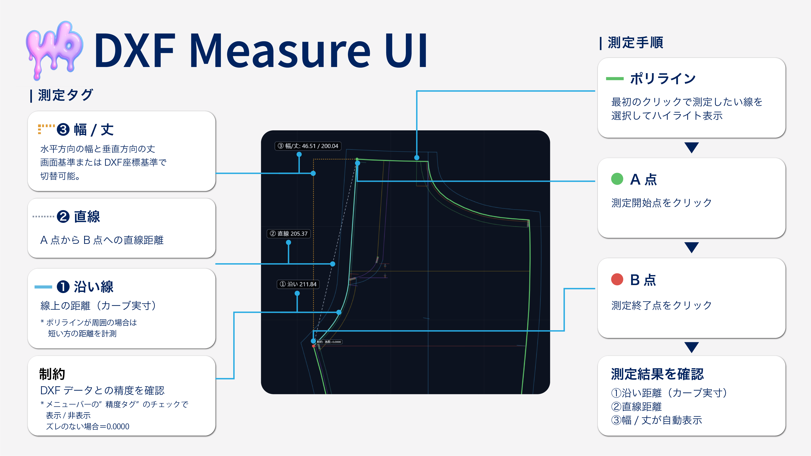

# みんなのDXF / Minna-no-DXF

DXF 計測ツール **Minna-no-DXF** のリポジトリです。以下はツールの UI の概要です。

## ドキュメントリンク

- [ユーザーガイド：基本操作](https://wory-bonbon.github.io/minna-no-dxf/dxf-measure-v41.html)
- [ユーザーガイド：スナップ精度](https://wory-bonbon.github.io/minna-no-dxf/measure-snap-accuracy-plain-v41.html)
- [開発者向け機能概要](docs/DEVELOPER_GUIDE.md)

上記リンクからユーザー向けガイドや開発者向け機能概要にアクセスできます。
---

## 🚀 概要

- 単一HTML（Preact + Tailwind）で動作するブラウザ完結型のDXFビューア／計測ツール
- DXFの `BLOCK` / `INSERT` / `LWPOLYLINE` / `POLYLINE` / `LINE` / `TEXT` / `MTEXT` を解析し、パーツ単位の表示・計測に対応
- A/B点スナップ、沿い距離・直線距離・幅/丈・パーツ回転の管理、計測ログ保存とCSV/SVG/PNG/PDF書き出しを提供
- DXFファイルはボタン選択とドラッグ＆ドロップの双方に対応し、ローカル上で完結

---

## 📁 ファイル入出力

### 読み込み
- ヘッダーの「ファイル」ボタン、サイドパネルのファイル入力、キャンバスへのドラッグ＆ドロップで `.dxf` を読み込む
- 文字コードは `Shift_JIS` → `MS932` → `UTF-8` の順で自動判別し、`SECTION`/`ENTITIES` の存在で正規データか確認  
- 読み込み時はA/B選択、ポリラインロック、表示パーツ、初回フィット状態をリセットし、ドキュメントキーも再計算

### 書き出し
- 計測ログをCSVへ出力（BOM付き）。`No/Time/File/Part/Note/Width/Length/Straight/Along` をmm換算で保存
- ヘッダーの書き出しグループから `PDF`/`SVG`/`PNG` を生成。`表示(全体/選択)`/`ALL` を切替えられ、目盛り描画（スケールバー）ON/OFFも可能
- `PNG` は透過背景・300dpi指定、`SVG` は1:1実寸出力でstroke=0.17mm。サイドパネルにも1:1固定のSVGショートカットを用意

---

## 🔧 DXF解析

- group code/value のペア配列化で全レコードを走査し、`HEADER` の `$TDCREATE`/`$TDUPDATE` を取得
- `BLOCK` 定義（基準点 10/20）と `INSERT`（名称2・挿入点10/20・スケール41/42・回転50）を解きほぐし、ワールド座標へ展開
- `LWPOLYLINE`/`POLYLINE`/`LINE` のポリライン情報、`TEXT`/`MTEXT` のラベル情報を抽出し、バウンディングボックスとパーツ名一覧を作成

---

## 📐 幾何処理・座標系

- ビュー行列（scale/tx/ty）と画面回転 `rot`（0/90/180/270°）でワールド→画面変換
- `fitToCanvas` で回転後のバウンディングを収めるスケール・平行移動を算出。回転時の自動フィットをトグル可
- パーツごとに90°単位の表示回転を保持（中心はbbox中央）。全体回転と独立して記録される
- グリッド描画は100×`scale`ピッチを基準に、8px以上で表示。スナップ結果は `tagOffset` を用いて視認しやすく調整

---

## 🎨 描画・UI

### Canvas描画
- 背景／グリッド／ポリライン／ラベル／計測オーバーレイを描画。ロック中ポリラインは太線で強調
- 画面左上：操作モードヒント（パン／ポリライン選択／A/B選択状態）を表示
- 画面右上：A/B間の要約カード（幅・丈・直線距離・沿い距離）を表示
- ログ表示は下部ドック（固定）またはフローティングウィンドウで切替可能。位置・サイズは永続化

### トップヘッダー（オーバーレイ）

| 機能グループ | 内容 | 操作 |
|------------|------|------|
| **ファイル管理** | `DXF Measure` ロゴとファイル名表示 | 「ファイル」ボタンで `.dxf` 読み込み |
| **書き出し設定** | 範囲選択、目盛り、PDF/SVG/PNG | `表示(全体/選択)` と `ALL` のスコープ選択、目盛りON/OFF |
| **全体回転制御** | 表示回転を90°刻み操作 | `↺全体` / `↻全体` / `全体0°` / 現在角度表示 |
| **フィット** | ワールド全体orロック中ポリライン | `Fit全体` / `Fitロック` ボタン |
| **単位設定** | mm換算倍率 | 数値入力フィールド |
| **表示トグル** | 各種表示ON/OFF | `ラベル` / `ガイド` / `精度タグ` |
| **パーツ操作** | パーツ選択と回転 | ドロップダウン、`↺パーツ` / `↻パーツ` / `パーツ0°` |
| **測定制御** | ロックとリセット | `同一ポリラインにロック`、`A/Bリセット` |
| **ログ制御** | 表示とモード切替 | `ログ▲/▼`、`ログPOP/ドック` |

### 計測ログパネル

| 要素 | 機能 | 操作方法 |
|------|------|----------|
| **ヘッダー** | ログ件数表示 | - |
| **CSV書き出し** | 測定データをExcel対応形式で保存 | ボタンクリック |
| **操作ボタン** | クリア、ドック切替、閉じる | 各ボタンクリック |
| **測定情報** | #番号・時刻・座標値 | - |
| **パーツ識別** | 測定対象のパーツ名 | ダブルクリックで名称変更 |
| **測定結果** | 幅/丈、直線距離、沿い距離 | - |
| **メモ欄** | 部位名を自由記入 | テキスト入力（例：股ぐり、肩線、脇線） |
| **個別削除** | 該当エントリーのみ削除 | 削除ボタン |

---

## 📏 計測機能

### スナップ
- 頂点優先スナップ（半径12px）。該当なしは線分最近点
- ロック中は対象ポリライン上のみスナップ。ロック解除で自由選択に戻る

### A/B操作
- 最初のクリックでロック対象確定、続くクリックでA/Bを交互に設定
- Shift併用で水平/垂直拘束。拘束時はdet判定を行い厳密な交点を採用
- A/Bはヘッダーのリセットボタンから個別に解除可能
- ※データによってはShiftが効かない場合がありその際は幅/丈を参照

### 計測値
| 種類 | 表示 | 用途 |
|------|------|------|
| **①沿い距離** | 青太線 | 短経路/長経路を計算、閉ループでは外周長も表示 |
| **②直線距離** | 灰点線 | A-B間の最短距離 |
| **③幅/丈** | 橙L字 | 水平・垂直距離 |

---

## 🗂️ パーツ管理

- パーツ表示名は `dxf-name-map:{docKey}` に永続化。ヘッダー、サイドパネル、計測ログから同一リネームUIを呼び出せる
- パーツ回転は `dxf-block-rot:{docKey}` に保存。パーツ選択時のみ `↺パーツ`/`↻パーツ`/`パーツ0°` が有効
- ログ項目のパーツ名はリネームマップを参照して表示される

---

## 💾 ログ・書き出し

- 計測ログは `dxf-measure-log:{docKey}` へ自動保存。ドキュメント切替時に遅延書込みで永続化
- CSVはBOM付きUTF-8。Excelなどで開いても文字化けしにくい形式
- ログドロワー設定は `dxf-log-dock` と `dxf-log-rect` に保持。ヘッダー操作で常に最新状態に保存

---

## 🔑 永続化・ドキュメントキー

**`docKey` 優先順：**
1. `HEADER.$TDCREATE`
2. DXF全文ハッシュ（SHA-256先頭16文字）
3. 文字列長などを基にした簡易ハッシュ

旧版キー（`name:size:lastModified`）からの移行ロジックを実装し、既存のパーツ名マップを引き継ぐ。

---

## 🖱️ 操作（マウス／キーボード）

| 操作 | 動作 |
|------|------|
| **左クリック** | スナップ選択（ロック対象／A/B） |
| **Shift+左クリック** | 水平/垂直拘束 |
| **ホイール** | ポインタ中心ズーム（`passive:false` で preventDefault） |
| **左ドラッグ** | パン（`grabbing` カーソル） |
| **ドラッグ＆ドロップ** | DXFファイル読み込み |

---

## ⚠️ 既知の制約・注意

- 円弧・スプラインなど未対応エンティティは描画対象外
- 全体回転はCanvas描画に適用されるが、書き出し（SVG/PNG/PDF）はパーツ回転のみ反映し、画面回転は反映しない
- 沿い距離はA/Bが同一ポリライン上の場合のみ計算。ポリラインを跨ぐ場合は未定義
- ①②③タグの位置調整は永続化されない（セッション限定）

---

## 🔧 実装メモ（技術）

- Preact (`preact/compat`) をReact API互換で使用。`ReactDOM.createRoot` のシムを内蔵
- Tailwind CDNを用いた軽量スタイル定義。独自スクロールバーのスタイリングを付与
- Canvas描画はピクセルスナップで滲みを軽減し、ロック時のポリラインを強調
- Ray × segment交差判定を実装し、Shift拘束時の交点を厳密に算出
- Fit処理では余白40pxを確保し、回転後のバウンディングからスケール・平行移動を導出

---

本ドキュメントはバージョン0922-41のコードベースをもとに作成しています。将来の更新でUIや仕様が変更される可能性があります。
